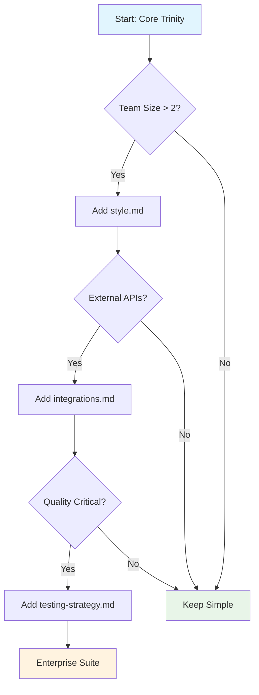

<div align="center">


</div>

<div align="center">

**🚀 The adaptive specification framework that grows with your project**


[**Specifications**](spec/) • [**Philosophy**](PRIZM.md) • [**Examples**](examples/) • [**Writing Guides**](spec/guides/)

</div>

---

## 📋 What is Prizm?

Prizm is a **specification-first framework** that helps you build better software through clear, evolving documentation. Unlike traditional documentation that becomes outdated, Prizm specifications are living documents that guide your development from start to finish.

### The Core Trinity

Every Prizm project starts with three essential specifications:

#### 📋 **requirements.md** - What to build
User stories, features, and acceptance criteria that define success.

#### 🏗️ **design.md** - How to build it
Architecture decisions, technical approach, and implementation patterns.

#### ✅ **tasks.md** - When to build it
Sprint planning, task breakdown, and development timeline.

### Progressive Enhancement

```
Start Simple                    → Add When Needed
━━━━━━━━━━━━━━━━━━━━━━━━━━━━━━━━━━━━━━━━━━━━━━━━━━
Core Trinity (3 files)          → + style.md (team consistency)
                               → + integrations.md (external APIs)
                               → + testing-strategy.md (quality)
                               → + security.md (authentication)
                               → + architecture.md (distributed)
                               → + deployment.md (production)
                               → ... up to 11+ specifications
```

## ✨ Why Specifications First?

### 🎯 **Clarity Before Code**
Write specifications to understand the problem before implementing solutions. Prevents costly rewrites.

### 🤖 **AI-Native Development**
Modern AI assistants work best with clear context. Well-structured specs enable better code generation.

### 📈 **Adaptive Complexity**
Start with 3 files. Add more only when their absence causes problems. No over-engineering.

### 🔄 **Living Documentation**
Specifications evolve with your code. They're not afterthoughts—they're the blueprint.

### 🏗️ **Battle-Tested Patterns**
Real-world templates from solo projects to enterprise systems. Learn from what works.

### 👥 **Team Alignment**
Everyone understands what's being built, how, and why. Reduces miscommunication.

---

## 🚀 Getting Started with Specifications

### Method 1: Manual Setup (Recommended for Learning)

1. **Browse the specification templates:**
   ```
   spec/
   ├── core/           # Start here
   │   ├── requirements.md
   │   ├── design.md
   │   └── tasks.md
   └── extended/       # Add as needed
   ```

2. **Copy templates to your project:**
   ```bash
   cp spec/core/*.md your-project/
   ```

3. **Fill in the specifications:**
   - Start with requirements.md - what are you building?
   - Design your approach in design.md
   - Plan your work in tasks.md

4. **Use with your favorite tools:**
   - AI assistants (Claude, Copilot, Cursor)
   - Your preferred editor
   - Version control

### Method 2: Automation (Future Enhancement)

Automation tools are planned to streamline specification management:

```bash
# Planned CLI features (in development):
# Initialize with templates
# Validate specifications  
# Generate reports
# Interactive setup
```

Remember: **the specifications themselves are the core value**. The framework is designed to work with any tools or workflows you prefer.

---

## 📚 Specification Examples

Learn from real-world examples organized by complexity:

### 🔧 [Simple CLI](examples/simple-cli/) - Todo List Application
Just the Core Trinity (3 files). Perfect for learning Prizm basics and solo projects.

[View Specifications →](examples/simple-cli/spec/)

### 🌐 [Web API](examples/web-api/) - Task Management API
Core Trinity + 3 extended specs. REST API with authentication and testing.

[View Specifications →](examples/web-api/spec/)

### 🚀 [SaaS App](examples/saas-app/) - Project Management Platform
Core Trinity + 6 extended specs. Multi-tenant SaaS with complex requirements.

[View Specifications →](examples/saas-app/spec/)

### 🏢 [Enterprise](examples/microservices/) - Distributed Platform
Complete suite (11+ specs). Microservices with full enterprise compliance.

[View Specifications →](examples/microservices/spec/)

---

## 📋 Writing Effective Specifications

### The Core Trinity in Practice

#### 📋 requirements.md

```markdown
## REQ-001: User Authentication
**Priority:** High
**Story:** As a user, I want to 
securely log in

**Acceptance Criteria:**
- [ ] Email/password login
- [ ] Session management
- [ ] Password reset flow
```

[Writing Guide →](spec/guides/writing-requirements.md)

#### 🏗️ design.md

```markdown
## Architecture
- Frontend: React + TypeScript
- Backend: Node.js + Express  
- Database: PostgreSQL

## API Design
POST /api/auth/login
{email, password} → {token}
```

[Design Patterns →](spec/guides/design-patterns.md)

#### ✅ tasks.md

```markdown
## Sprint 1: Authentication
- [ ] Database schema
- [ ] User model
- [ ] Login endpoint
- [ ] Frontend form
- [ ] Integration tests
```

[Planning Guide →](spec/guides/task-planning.md)

---


## 🤖 Working with AI Assistants

Prizm specifications provide perfect context for AI pair programming:

### Example AI Prompts

**With Claude Code:**
```
"Based on requirements.md, implement the user authentication system"
"Review this code against our design.md architecture"
"Generate tests for REQ-003 following testing-strategy.md"
```

**With GitHub Copilot:**
```javascript
// Read requirements.md for auth specs
// Follow patterns from design.md
const authenticateUser = async (credentials) => {
  // Copilot understands your project context
}
```

**With Cursor:**
```
"Update this to match style.md conventions"
"Create API endpoints from requirements.md"
"Refactor following architecture.md patterns"
```

### Why AI Works Better with Prizm

1. **Clear Context** - Specifications provide unambiguous requirements
2. **Consistent Patterns** - AI learns from your documented conventions  
3. **Living Documentation** - Always current, never outdated
4. **Structured Format** - Easy for AI to parse and understand

[**→ Full AI Integration Guide**](spec/prompts/)

---

## 📊 Progressive Documentation

<div align="center">



</div>

<details>
<summary><b>📈 When to Add Extended Documents</b></summary>

| Document | Add When | Purpose |
|----------|----------|---------|
| **style.md** | Team size > 2 | Coding standards and patterns |
| **testing-strategy.md** | Quality requirements are high | Comprehensive testing approach |
| **integrations.md** | Multiple external services | API and service documentation |
| **domain.md** | Complex business logic | Business rules and domain models |
| **constraints.md** | Technical/business limitations | Project constraints and decisions |
| **architecture.md** | Distributed systems | High-level system architecture |
| **security.md** | Security requirements | Security patterns and compliance |
| **deployment.md** | Production deployments | Infrastructure and operations |

</details>

---


## 🌟 The Prizm Approach

### Start Where You Are

**New Project?** Begin with the Core Trinity templates  
**Existing Project?** Document what you have, improve incrementally  
**Complex System?** Add extended specs only as needed

### Specification Benefits

#### ⚡ **Faster Development**
Clear specs = less rework

#### 🤖 **Better AI Results**
Structured context = better code

#### 👥 **Team Alignment**
Shared understanding = fewer conflicts

#### 📈 **Sustainable Growth**
Living docs = maintainable code

### Learn More

- 📖 **[Specification Templates](spec/)** - Browse all templates
- 📝 **[Writing Guides](spec/guides/)** - Learn to write effective specs
- 👁 **[Examples](examples/)** - See real-world usage
- 💡 **[Philosophy](PRIZM.md)** - Understand the approach