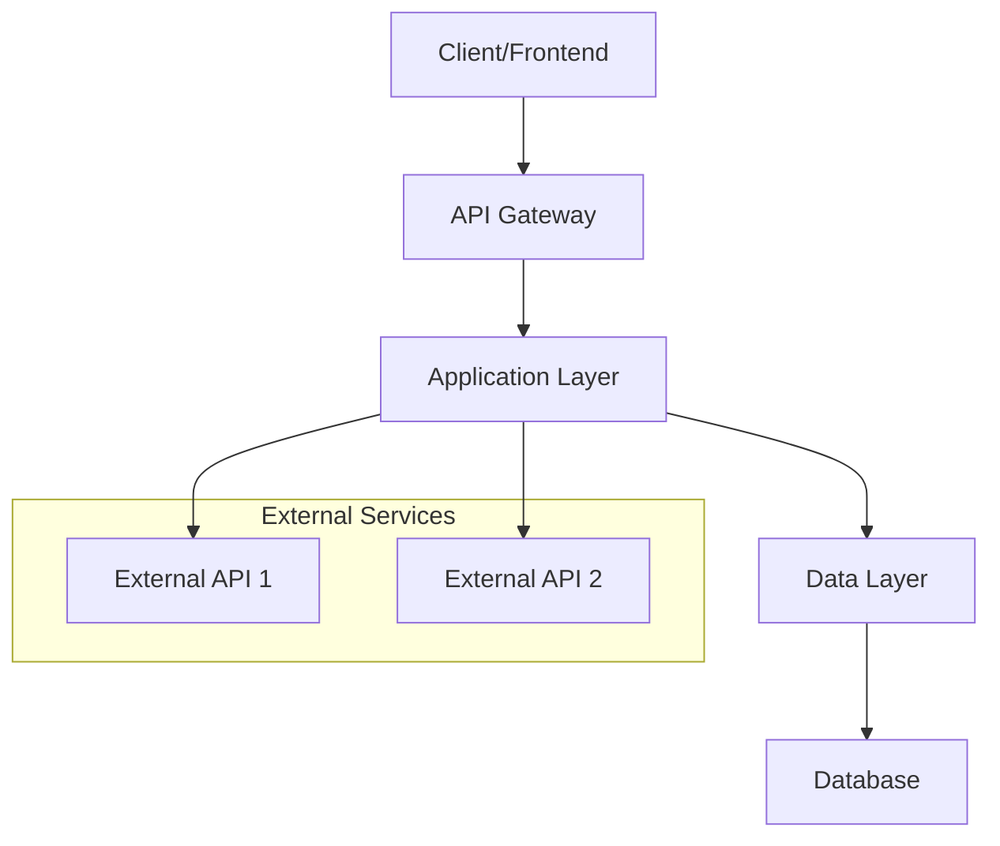
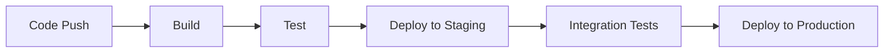

# Design Document

## Overview

[Technical overview of the solution - what are you building and how does it work at a high level]

**Design Philosophy:** [Core principles guiding the design]  
**Target Architecture:** [Monolith, microservices, serverless, etc.]  
**Key Design Decisions:** [Major architectural choices and rationale]

## Architecture

### High-Level Architecture



### System Components

#### Component 1: [Component Name]

**Purpose:** [What this component does]  
**Responsibilities:** 
- [Responsibility 1]
- [Responsibility 2]

**Interfaces:**
- [Interface 1]
- [Interface 2]

#### Component 2: [Component Name]

**Purpose:** [What this component does]  
**Responsibilities:** 
- [Responsibility 1]
- [Responsibility 2]

**Interfaces:**
- [Interface 1]
- [Interface 2]

### Technology Stack

- **Frontend:** [Framework/Library - React, Vue, Angular, etc.]
- **Backend:** [Language/Framework - Node.js, Python/FastAPI, etc.]
- **Database:** [Database type - PostgreSQL, MongoDB, etc.]
- **Cache:** [Caching solution - Redis, Memcached, etc.]
- **Queue:** [Message queue - RabbitMQ, SQS, etc.]
- **Authentication:** [Auth solution - JWT, OAuth, etc.]
- **Deployment:** [Platform - Docker, Kubernetes, etc.]
- **Monitoring:** [Monitoring tools - Prometheus, DataDog, etc.]

## Core Principles

1. **[Principle 1]:** [Description and how it influences design]
2. **[Principle 2]:** [Description and how it influences design]
3. **[Principle 3]:** [Description and how it influences design]

## Data Design

### Data Models

#### [Model Name]

```typescript
interface [ModelName] {
  id: string;
  [property1]: [type];
  [property2]: [type];
  createdAt: Date;
  updatedAt: Date;
}
```

**Relationships:**
- [Relationship description]

**Constraints:**
- [Constraint 1]
- [Constraint 2]

### Database Schema

```sql
CREATE TABLE [table_name] (
    id SERIAL PRIMARY KEY,
    [column1] [type] NOT NULL,
    [column2] [type],
    created_at TIMESTAMP DEFAULT CURRENT_TIMESTAMP,
    updated_at TIMESTAMP DEFAULT CURRENT_TIMESTAMP
);
```

## API Design

### RESTful Endpoints

#### [Resource Name]

```
GET    /api/[resource]       - List all [resource]
GET    /api/[resource]/:id   - Get specific [resource]
POST   /api/[resource]       - Create new [resource]
PUT    /api/[resource]/:id   - Update [resource]
DELETE /api/[resource]/:id   - Delete [resource]
```

#### Request/Response Examples

**Create [Resource]:**
```json
POST /api/[resource]
{
  "[property1]": "[value1]",
  "[property2]": "[value2]"
}
```

**Response:**
```json
{
  "id": "123",
  "[property1]": "[value1]",
  "[property2]": "[value2]",
  "createdAt": "2024-01-01T00:00:00Z"
}
```

### GraphQL Schema (if applicable)

```graphql
type [TypeName] {
  id: ID!
  [property1]: [Type]!
  [property2]: [Type]
  createdAt: DateTime!
}

type Query {
  [queryName]([parameters]): [TypeName]
}

type Mutation {
  [mutationName]([parameters]): [TypeName]
}
```

## Security Design

### Authentication Strategy

- **Method:** [JWT, OAuth2, session-based, etc.]
- **Flow:** [Description of auth flow]
- **Token Management:** [How tokens are stored and refreshed]

### Authorization Model

- **RBAC:** [Role-based access control description]
- **Permissions:** [Permission structure]
- **Resource Protection:** [How resources are protected]

### Security Measures

- **Input Validation:** [Validation strategy]
- **Rate Limiting:** [Rate limiting approach]
- **CORS:** [Cross-origin resource sharing policy]
- **HTTPS:** [SSL/TLS configuration]

## Performance Design

### Caching Strategy

- **Application Cache:** [What gets cached at app level]
- **Database Cache:** [Database caching approach]
- **CDN:** [Content delivery network strategy]

### Optimization Approaches

- **Database Indexing:** [Index strategy]
- **Query Optimization:** [Query optimization techniques]
- **Asset Optimization:** [Frontend asset optimization]

## Error Handling

### Error Types

1. **Validation Errors:** [How validation errors are handled]
2. **Authentication Errors:** [Auth error handling]
3. **System Errors:** [Internal error handling]
4. **External Service Errors:** [Third-party service error handling]

### Error Response Format

```json
{
  "error": {
    "code": "ERROR_CODE",
    "message": "Human-readable error message",
    "details": {
      "field": "specific field error"
    }
  }
}
```

## Testing Strategy

### Unit Testing

- **Framework:** [Testing framework]
- **Coverage Target:** [Coverage percentage goal]
- **Test Structure:** [How tests are organized]

### Integration Testing

- **API Testing:** [API testing approach]
- **Database Testing:** [Database testing strategy]
- **External Service Testing:** [Mock/stub strategy]

### End-to-End Testing

- **Framework:** [E2E testing framework]
- **Test Scenarios:** [Key user journeys to test]
- **Environment:** [Testing environment setup]

## Deployment Architecture

### Environment Strategy

- **Development:** [Dev environment setup]
- **Staging:** [Staging environment configuration]
- **Production:** [Production environment design]

### CI/CD Pipeline



### Infrastructure

- **Hosting:** [Cloud provider/hosting solution]
- **Containerization:** [Docker/container strategy]
- **Orchestration:** [Kubernetes/orchestration approach]
- **Monitoring:** [Monitoring and alerting setup]

## Monitoring and Observability

### Metrics

- **Application Metrics:** [Key application metrics]
- **Infrastructure Metrics:** [Infrastructure monitoring]
- **Business Metrics:** [Business KPIs to track]

### Logging

- **Log Levels:** [Logging level strategy]
- **Log Format:** [Structured logging format]
- **Log Aggregation:** [Log collection and analysis]

### Alerting

- **Critical Alerts:** [System-down scenarios]
- **Warning Alerts:** [Performance degradation]
- **Escalation:** [Alert escalation process]

## Migration Strategy

### Data Migration

- **Migration Plan:** [How existing data will be migrated]
- **Rollback Strategy:** [How to rollback if needed]
- **Testing:** [Migration testing approach]

### Feature Rollout

- **Phased Rollout:** [Gradual feature release plan]
- **Feature Flags:** [Feature toggle strategy]
- **User Communication:** [How users will be informed]

## Risks and Mitigation

### Technical Risks

1. **[Risk 1]:** [Description and mitigation strategy]
2. **[Risk 2]:** [Description and mitigation strategy]

### Operational Risks

1. **[Risk 1]:** [Description and mitigation strategy]
2. **[Risk 2]:** [Description and mitigation strategy]

## Future Considerations

### Scalability

- **Horizontal Scaling:** [How the system can scale out]
- **Vertical Scaling:** [How the system can scale up]
- **Bottlenecks:** [Potential bottlenecks and solutions]

### Extensions

- **Planned Features:** [Future features to consider]
- **Architecture Evolution:** [How architecture might evolve]
- **Technology Upgrades:** [Planned technology updates]

---

**Document Version:** 1.0  
**Last Updated:** [Date]  
**Next Review:** [Date]  
**Approved By:** [Name and Role]