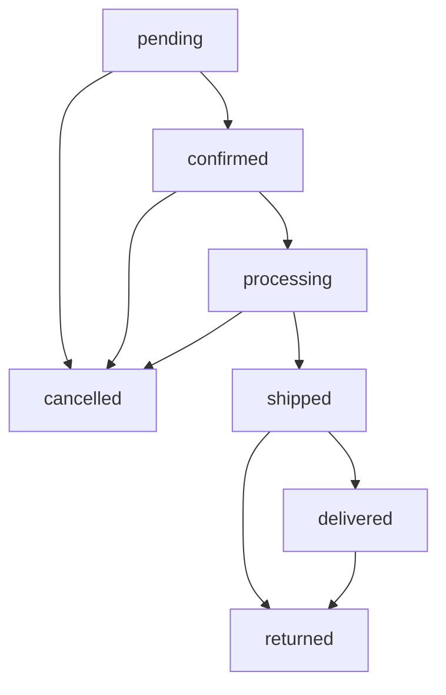
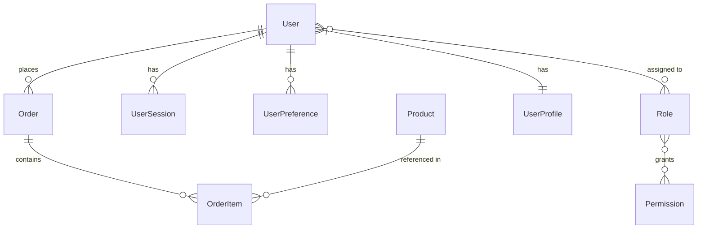

# Data Models

## Overview

This document defines the detailed data models, schemas, and relationships for [PROJECT NAME]. It serves as the authoritative source for understanding data structure, validation rules, and storage patterns.

**Project:** [PROJECT NAME]  
**Database:** [Primary database technology]  
**Schema Version:** [Current schema version]  
**Migration Strategy:** [How schema changes are managed]

## Core Data Models

### User

**Purpose:** [What this model represents in the business domain]  
**Table Name:** `users`  
**Primary Key:** `id`

#### Schema Definition

**SQL Schema:**
```sql
CREATE TABLE users (
    id UUID PRIMARY KEY DEFAULT gen_random_uuid(),
    email VARCHAR(255) UNIQUE NOT NULL,
    username VARCHAR(50) UNIQUE NOT NULL,
    password_hash VARCHAR(255) NOT NULL,
    first_name VARCHAR(100) NOT NULL,
    last_name VARCHAR(100) NOT NULL,
    phone VARCHAR(20),
    date_of_birth DATE,
    status VARCHAR(20) DEFAULT 'active',
    email_verified BOOLEAN DEFAULT false,
    created_at TIMESTAMP WITH TIME ZONE DEFAULT CURRENT_TIMESTAMP,
    updated_at TIMESTAMP WITH TIME ZONE DEFAULT CURRENT_TIMESTAMP,
    last_login_at TIMESTAMP WITH TIME ZONE
);
```

**TypeScript Interface:**
```typescript
interface User {
  id: string;
  email: string;
  username: string;
  passwordHash: string;
  firstName: string;
  lastName: string;
  phone?: string;
  dateOfBirth?: Date;
  status: 'active' | 'inactive' | 'suspended';
  emailVerified: boolean;
  createdAt: Date;
  updatedAt: Date;
  lastLoginAt?: Date;
}
```

**JSON Schema:**
```json
{
  "type": "object",
  "properties": {
    "id": { "type": "string", "format": "uuid" },
    "email": { "type": "string", "format": "email" },
    "username": { "type": "string", "minLength": 3, "maxLength": 50 },
    "firstName": { "type": "string", "minLength": 1, "maxLength": 100 },
    "lastName": { "type": "string", "minLength": 1, "maxLength": 100 },
    "phone": { "type": "string", "pattern": "^\\+?[1-9]\\d{1,14}$" },
    "dateOfBirth": { "type": "string", "format": "date" },
    "status": { "enum": ["active", "inactive", "suspended"] }
  },
  "required": ["email", "username", "firstName", "lastName"]
}
```

#### Validation Rules

**Field Validations:**
- **email:** Must be unique, valid email format
- **username:** Must be unique, 3-50 characters, alphanumeric + underscore
- **password:** Minimum 8 characters, must contain uppercase, lowercase, number
- **phone:** Optional, E.164 format when provided
- **status:** Must be one of: active, inactive, suspended

**Business Rules:**
- Users cannot be deleted, only marked as inactive
- Email verification required before account activation
- Username cannot be changed once set
- Suspended users cannot login

**Validation Implementation:**
```javascript
const userValidation = {
  email: {
    required: true,
    format: 'email',
    unique: true
  },
  username: {
    required: true,
    minLength: 3,
    maxLength: 50,
    pattern: /^[a-zA-Z0-9_]+$/,
    unique: true
  },
  password: {
    required: true,
    minLength: 8,
    pattern: /^(?=.*[a-z])(?=.*[A-Z])(?=.*\d)/
  }
};
```

#### Indexes

```sql
-- Primary indexes
CREATE INDEX idx_users_email ON users(email);
CREATE INDEX idx_users_username ON users(username);
CREATE INDEX idx_users_status ON users(status);

-- Composite indexes
CREATE INDEX idx_users_status_created ON users(status, created_at);
CREATE INDEX idx_users_last_login ON users(last_login_at) WHERE last_login_at IS NOT NULL;
```

#### Relationships

**One-to-Many:**
- User → UserSessions (1:N)
- User → UserPreferences (1:N)
- User → Orders (1:N)

**Many-to-Many:**
- User ↔ Role (through UserRoles)
- User ↔ Permission (through UserPermissions)

---

### Order

**Purpose:** [What this model represents in the business domain]  
**Table Name:** `orders`  
**Primary Key:** `id`

#### Schema Definition

**SQL Schema:**
```sql
CREATE TABLE orders (
    id UUID PRIMARY KEY DEFAULT gen_random_uuid(),
    user_id UUID NOT NULL REFERENCES users(id),
    order_number VARCHAR(20) UNIQUE NOT NULL,
    status VARCHAR(20) NOT NULL DEFAULT 'pending',
    total_amount DECIMAL(10,2) NOT NULL,
    currency VARCHAR(3) NOT NULL DEFAULT 'USD',
    tax_amount DECIMAL(10,2) NOT NULL DEFAULT 0,
    shipping_amount DECIMAL(10,2) NOT NULL DEFAULT 0,
    discount_amount DECIMAL(10,2) NOT NULL DEFAULT 0,
    billing_address JSONB,
    shipping_address JSONB,
    payment_method VARCHAR(50),
    payment_status VARCHAR(20) DEFAULT 'pending',
    notes TEXT,
    created_at TIMESTAMP WITH TIME ZONE DEFAULT CURRENT_TIMESTAMP,
    updated_at TIMESTAMP WITH TIME ZONE DEFAULT CURRENT_TIMESTAMP,
    shipped_at TIMESTAMP WITH TIME ZONE,
    delivered_at TIMESTAMP WITH TIME ZONE
);
```

**TypeScript Interface:**
```typescript
interface Order {
  id: string;
  userId: string;
  orderNumber: string;
  status: OrderStatus;
  totalAmount: number;
  currency: string;
  taxAmount: number;
  shippingAmount: number;
  discountAmount: number;
  billingAddress?: Address;
  shippingAddress?: Address;
  paymentMethod?: string;
  paymentStatus: PaymentStatus;
  notes?: string;
  createdAt: Date;
  updatedAt: Date;
  shippedAt?: Date;
  deliveredAt?: Date;
}

type OrderStatus = 'pending' | 'confirmed' | 'processing' | 'shipped' | 'delivered' | 'cancelled';
type PaymentStatus = 'pending' | 'paid' | 'failed' | 'refunded';

interface Address {
  street: string;
  city: string;
  state: string;
  postalCode: string;
  country: string;
}
```

#### State Machine

**Order Status Flow:**


**Validation Rules:**
- Status transitions must follow the state machine
- Cannot cancel shipped or delivered orders
- Total amount must equal sum of line items + tax + shipping - discount
- Payment must be confirmed before processing

#### Indexes

```sql
CREATE INDEX idx_orders_user_id ON orders(user_id);
CREATE INDEX idx_orders_status ON orders(status);
CREATE INDEX idx_orders_number ON orders(order_number);
CREATE INDEX idx_orders_created_at ON orders(created_at);
CREATE INDEX idx_orders_payment_status ON orders(payment_status);
```

---

### OrderItem

**Purpose:** Line items within an order  
**Table Name:** `order_items`  
**Primary Key:** `id`

#### Schema Definition

**SQL Schema:**
```sql
CREATE TABLE order_items (
    id UUID PRIMARY KEY DEFAULT gen_random_uuid(),
    order_id UUID NOT NULL REFERENCES orders(id) ON DELETE CASCADE,
    product_id UUID NOT NULL REFERENCES products(id),
    quantity INTEGER NOT NULL CHECK (quantity > 0),
    unit_price DECIMAL(10,2) NOT NULL,
    total_price DECIMAL(10,2) NOT NULL,
    product_snapshot JSONB NOT NULL,
    created_at TIMESTAMP WITH TIME ZONE DEFAULT CURRENT_TIMESTAMP,
    updated_at TIMESTAMP WITH TIME ZONE DEFAULT CURRENT_TIMESTAMP
);
```

**TypeScript Interface:**
```typescript
interface OrderItem {
  id: string;
  orderId: string;
  productId: string;
  quantity: number;
  unitPrice: number;
  totalPrice: number;
  productSnapshot: ProductSnapshot;
  createdAt: Date;
  updatedAt: Date;
}

interface ProductSnapshot {
  name: string;
  description: string;
  sku: string;
  category: string;
  attributes: Record<string, any>;
}
```

#### Business Rules

- Total price must equal quantity × unit price
- Product snapshot preserves product details at time of order
- Cannot modify order items after order is confirmed
- Quantity must be positive integer

#### Indexes

```sql
CREATE INDEX idx_order_items_order_id ON order_items(order_id);
CREATE INDEX idx_order_items_product_id ON order_items(product_id);
```

---

## Data Relationships

### Entity Relationship Diagram



### Foreign Key Constraints

```sql
-- Order references User
ALTER TABLE orders ADD CONSTRAINT fk_orders_user_id 
    FOREIGN KEY (user_id) REFERENCES users(id) ON DELETE RESTRICT;

-- OrderItem references Order
ALTER TABLE order_items ADD CONSTRAINT fk_order_items_order_id 
    FOREIGN KEY (order_id) REFERENCES orders(id) ON DELETE CASCADE;

-- OrderItem references Product
ALTER TABLE order_items ADD CONSTRAINT fk_order_items_product_id 
    FOREIGN KEY (product_id) REFERENCES products(id) ON DELETE RESTRICT;
```

### Referential Integrity Rules

**Cascade Deletes:**
- When Order is deleted → OrderItems are deleted
- When User is deleted → Orders are NOT deleted (RESTRICT)

**Update Cascades:**
- User ID changes → Order user_id updates
- Product ID changes → OrderItem product_id updates

## Data Access Patterns

### Common Queries

#### Get User Orders
```sql
SELECT o.*, 
       COUNT(oi.id) as item_count,
       SUM(oi.total_price) as calculated_total
FROM orders o
LEFT JOIN order_items oi ON o.id = oi.order_id
WHERE o.user_id = $1
GROUP BY o.id
ORDER BY o.created_at DESC;
```

#### Get Order with Items
```sql
SELECT o.*,
       json_agg(
         json_build_object(
           'id', oi.id,
           'quantity', oi.quantity,
           'unitPrice', oi.unit_price,
           'totalPrice', oi.total_price,
           'product', oi.product_snapshot
         )
       ) as items
FROM orders o
LEFT JOIN order_items oi ON o.id = oi.order_id
WHERE o.id = $1
GROUP BY o.id;
```

#### User Search
```sql
SELECT id, email, username, first_name, last_name, status
FROM users
WHERE 
  status = 'active' AND (
    email ILIKE '%' || $1 || '%' OR
    username ILIKE '%' || $1 || '%' OR
    first_name ILIKE '%' || $1 || '%' OR
    last_name ILIKE '%' || $1 || '%'
  )
ORDER BY created_at DESC
LIMIT 20;
```

### Performance Optimization

#### Query Optimization
- Use appropriate indexes for common queries
- Avoid N+1 queries with proper JOINs
- Use pagination for large result sets
- Consider query result caching

#### Index Strategy
- Primary keys on all tables
- Foreign key indexes
- Composite indexes for common filter combinations
- Partial indexes for filtered queries

## Data Validation

### Application-Level Validation

**User Model Validation:**
```javascript
class UserValidator {
  static validate(userData) {
    const errors = [];
    
    if (!userData.email || !this.isValidEmail(userData.email)) {
      errors.push('Valid email is required');
    }
    
    if (!userData.username || userData.username.length < 3) {
      errors.push('Username must be at least 3 characters');
    }
    
    if (!this.isValidPassword(userData.password)) {
      errors.push('Password must be at least 8 characters with uppercase, lowercase, and number');
    }
    
    return errors;
  }
  
  static isValidEmail(email) {
    const emailRegex = /^[^\s@]+@[^\s@]+\.[^\s@]+$/;
    return emailRegex.test(email);
  }
  
  static isValidPassword(password) {
    const passwordRegex = /^(?=.*[a-z])(?=.*[A-Z])(?=.*\d).{8,}$/;
    return passwordRegex.test(password);
  }
}
```

### Database-Level Validation

**Check Constraints:**
```sql
-- Email format validation
ALTER TABLE users ADD CONSTRAINT chk_users_email_format 
    CHECK (email ~* '^[A-Za-z0-9._%+-]+@[A-Za-z0-9.-]+\.[A-Za-z]{2,}$');

-- Username format validation
ALTER TABLE users ADD CONSTRAINT chk_users_username_format 
    CHECK (username ~* '^[a-zA-Z0-9_]{3,50}$');

-- Order amount validation
ALTER TABLE orders ADD CONSTRAINT chk_orders_positive_amounts 
    CHECK (total_amount >= 0 AND tax_amount >= 0 AND shipping_amount >= 0);

-- Order item quantity validation
ALTER TABLE order_items ADD CONSTRAINT chk_order_items_positive_quantity 
    CHECK (quantity > 0);
```

## Data Migration

### Migration Strategy

**Version Control:**
- All schema changes tracked in version control
- Sequential migration numbering
- Rollback scripts for each migration
- Test migrations in staging environment

**Migration Example:**
```sql
-- Migration: 001_create_users_table.sql
BEGIN;

CREATE TABLE users (
    id UUID PRIMARY KEY DEFAULT gen_random_uuid(),
    email VARCHAR(255) UNIQUE NOT NULL,
    username VARCHAR(50) UNIQUE NOT NULL,
    created_at TIMESTAMP WITH TIME ZONE DEFAULT CURRENT_TIMESTAMP
);

CREATE INDEX idx_users_email ON users(email);
CREATE INDEX idx_users_username ON users(username);

COMMIT;
```

**Rollback Example:**
```sql
-- Rollback: 001_create_users_table.sql
BEGIN;

DROP TABLE IF EXISTS users;

COMMIT;
```

### Data Seeding

**Development Seeds:**
```sql
-- Development seed data
INSERT INTO users (email, username, first_name, last_name, status)
VALUES 
  ('admin@example.com', 'admin', 'Admin', 'User', 'active'),
  ('user1@example.com', 'user1', 'Test', 'User', 'active'),
  ('user2@example.com', 'user2', 'Demo', 'User', 'active');
```

**Production Seeds:**
```sql
-- Production seed data (minimal)
INSERT INTO roles (name, description)
VALUES 
  ('admin', 'System administrator'),
  ('user', 'Regular user');
```

## Data Security

### Sensitive Data Handling

**Encryption at Rest:**
- Password hashes using bcrypt
- Sensitive fields encrypted using application-level encryption
- Database-level encryption for compliance

**Encryption in Transit:**
- SSL/TLS for all database connections
- Encrypted backups
- Secure data export/import

**Data Masking:**
```sql
-- Data masking for non-production environments
UPDATE users SET 
    email = CONCAT('user', id, '@example.com'),
    first_name = 'Test',
    last_name = 'User',
    phone = NULL
WHERE id NOT IN (SELECT id FROM users WHERE email LIKE '%@company.com');
```

### Access Control

**Database Users:**
- Application user with limited privileges
- Read-only user for reporting
- Admin user for migrations

**Row Level Security:**
```sql
-- Enable RLS on orders table
ALTER TABLE orders ENABLE ROW LEVEL SECURITY;

-- Policy: users can only see their own orders
CREATE POLICY user_orders_policy ON orders
    FOR ALL TO application_user
    USING (user_id = current_setting('app.current_user_id')::UUID);
```

## Monitoring and Maintenance

### Health Checks

**Database Health:**
```sql
-- Check database connectivity
SELECT 1 as healthy;

-- Check table sizes
SELECT 
    tablename,
    pg_size_pretty(pg_total_relation_size(schemaname||'.'||tablename)) as size
FROM pg_tables 
WHERE schemaname = 'public'
ORDER BY pg_total_relation_size(schemaname||'.'||tablename) DESC;
```

### Performance Monitoring

**Slow Query Detection:**
```sql
-- Enable slow query logging
SET log_min_duration_statement = 1000; -- Log queries > 1 second

-- Query performance statistics
SELECT 
    query,
    calls,
    total_time,
    mean_time,
    rows
FROM pg_stat_statements
ORDER BY mean_time DESC
LIMIT 10;
```

### Backup and Recovery

**Backup Strategy:**
- Daily full backups
- Continuous WAL archiving
- Point-in-time recovery capability
- Cross-region backup replication

**Recovery Testing:**
- Monthly recovery tests
- Documented recovery procedures
- RTO/RPO targets defined

---

**Document Version:** 1.0  
**Last Updated:** [Date]  
**Database Owner:** [Name and Role]  
**Next Review:** [Date]