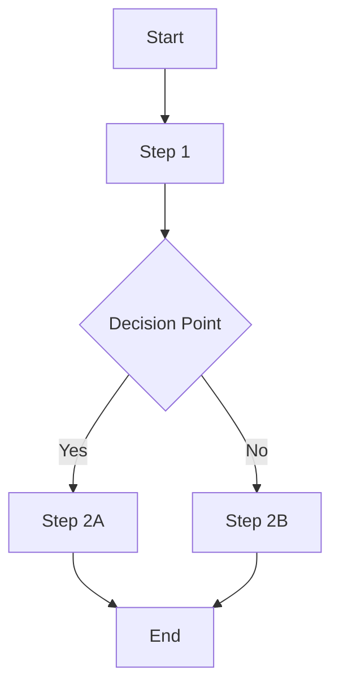

# Domain Model

## Overview

This document defines the business domain concepts, rules, and language that govern [PROJECT NAME]. It serves as the authoritative source for understanding the business context and domain-specific logic.

**Domain:** [Business domain - e.g., e-commerce, healthcare, finance]  
**Scope:** [What aspects of the domain are covered]  
**Audience:** [Developers, product managers, business analysts]

## Domain Concepts

### Core Entities

#### [Entity Name 1]

**Definition:** [Clear definition of what this entity represents]

**Properties:**
- **[Property 1]:** [Description and business meaning]
- **[Property 2]:** [Description and business meaning]
- **[Property 3]:** [Description and business meaning]

**Business Rules:**
- [Rule 1: Description of business rule]
- [Rule 2: Description of business rule]

**Lifecycle:**
1. [State 1] → [State 2]: [Trigger and conditions]
2. [State 2] → [State 3]: [Trigger and conditions]

**Example:**
```
[Entity Name]: "Example Entity"
- [Property 1]: "Example value"
- [Property 2]: "Example value"
```

---

#### [Entity Name 2]

**Definition:** [Clear definition of what this entity represents]

**Properties:**
- **[Property 1]:** [Description and business meaning]
- **[Property 2]:** [Description and business meaning]

**Business Rules:**
- [Rule 1: Description of business rule]
- [Rule 2: Description of business rule]

**Relationships:**
- [Relationship 1]: [Description of relationship to other entities]
- [Relationship 2]: [Description of relationship to other entities]

---

## Domain Services

### [Service Name 1]

**Purpose:** [What business capability this service provides]

**Operations:**
- **[Operation 1]:** [Description of business operation]
- **[Operation 2]:** [Description of business operation]

**Business Rules:**
- [Rule 1: When this service applies]
- [Rule 2: How this service behaves]

**Dependencies:**
- [Entity dependencies]
- [External service dependencies]

---

### [Service Name 2]

**Purpose:** [What business capability this service provides]

**Operations:**
- **[Operation 1]:** [Description of business operation]
- **[Operation 2]:** [Description of business operation]

**Business Rules:**
- [Rule 1: When this service applies]
- [Rule 2: How this service behaves]

---

## Business Rules

### Validation Rules

#### [Rule Category 1]

1. **[Rule Name]:** [Detailed description of the rule]
   - **When:** [Conditions when this rule applies]
   - **Then:** [What should happen]
   - **Example:** [Concrete example]

2. **[Rule Name]:** [Detailed description of the rule]
   - **When:** [Conditions when this rule applies]
   - **Then:** [What should happen]
   - **Example:** [Concrete example]

#### [Rule Category 2]

1. **[Rule Name]:** [Detailed description of the rule]
   - **When:** [Conditions when this rule applies]
   - **Then:** [What should happen]
   - **Example:** [Concrete example]

### Process Rules

#### [Process Name 1]

**Trigger:** [What starts this process]

**Steps:**
1. [Step 1: Description]
2. [Step 2: Description]
3. [Step 3: Description]

**Business Rules:**
- [Rule 1: Process constraint]
- [Rule 2: Process constraint]

**Exception Handling:**
- [Exception 1: What happens if...]
- [Exception 2: What happens if...]

---

#### [Process Name 2]

**Trigger:** [What starts this process]

**Steps:**
1. [Step 1: Description]
2. [Step 2: Description]

**Business Rules:**
- [Rule 1: Process constraint]
- [Rule 2: Process constraint]

---

## Domain Events

### [Event Name 1]

**When:** [When this event occurs]  
**Payload:** [What information is included]  
**Consequences:** [What happens as a result]

**Example:**
```json
{
  "eventType": "[Event Name]",
  "timestamp": "2024-01-01T00:00:00Z",
  "data": {
    "[property1]": "[value1]",
    "[property2]": "[value2]"
  }
}
```

---

### [Event Name 2]

**When:** [When this event occurs]  
**Payload:** [What information is included]  
**Consequences:** [What happens as a result]

---

## Workflows

### [Workflow Name 1]

**Purpose:** [What business process this workflow supports]

**Actors:**
- **[Actor 1]:** [Role and responsibilities]
- **[Actor 2]:** [Role and responsibilities]

**Flow:**


**Business Rules:**
- [Rule 1: Workflow constraint]
- [Rule 2: Workflow constraint]

**Error Scenarios:**
- [Error 1: What happens if...]
- [Error 2: What happens if...]

---

### [Workflow Name 2]

**Purpose:** [What business process this workflow supports]

**Actors:**
- **[Actor 1]:** [Role and responsibilities]

**Flow:**
[Workflow description or diagram]

---

## Domain Language (Ubiquitous Language)

### Business Terms

- **[Term 1]:** [Definition used consistently across the domain]
- **[Term 2]:** [Definition used consistently across the domain]
- **[Term 3]:** [Definition used consistently across the domain]

### Status Values

- **[Status 1]:** [What this status means in business terms]
- **[Status 2]:** [What this status means in business terms]
- **[Status 3]:** [What this status means in business terms]

### Business Categories

- **[Category 1]:** [Definition and examples]
- **[Category 2]:** [Definition and examples]
- **[Category 3]:** [Definition and examples]

## Constraints and Invariants

### Business Constraints

1. **[Constraint 1]:** [Description of business constraint]
   - **Rationale:** [Why this constraint exists]
   - **Impact:** [How this affects the system]

2. **[Constraint 2]:** [Description of business constraint]
   - **Rationale:** [Why this constraint exists]
   - **Impact:** [How this affects the system]

### Data Invariants

1. **[Invariant 1]:** [Description of data invariant]
   - **Validation:** [How to check this invariant]
   - **Violation:** [What happens if violated]

2. **[Invariant 2]:** [Description of data invariant]
   - **Validation:** [How to check this invariant]
   - **Violation:** [What happens if violated]

## Integration Points

### External Systems

#### [System Name 1]

**Purpose:** [What this system provides to our domain]  
**Interface:** [How we interact with this system]  
**Data Exchange:** [What data is exchanged]  
**Business Rules:** [Rules that apply to this integration]

#### [System Name 2]

**Purpose:** [What this system provides to our domain]  
**Interface:** [How we interact with this system]  
**Data Exchange:** [What data is exchanged]  
**Business Rules:** [Rules that apply to this integration]

## Domain Boundaries

### What's Inside the Domain

- [Responsibility 1]
- [Responsibility 2]
- [Responsibility 3]

### What's Outside the Domain

- [External responsibility 1]
- [External responsibility 2]
- [External responsibility 3]

### Context Boundaries

- **[Bounded Context 1]:** [Description of context and boundaries]
- **[Bounded Context 2]:** [Description of context and boundaries]

## Anti-Patterns

### Common Mistakes

1. **[Anti-pattern 1]:** [Description of what to avoid]
   - **Problem:** [Why this is problematic]
   - **Solution:** [Correct approach]

2. **[Anti-pattern 2]:** [Description of what to avoid]
   - **Problem:** [Why this is problematic]
   - **Solution:** [Correct approach]

---

**Document Version:** 1.0  
**Last Updated:** [Date]  
**Domain Expert:** [Name and Role]  
**Next Review:** [Date]